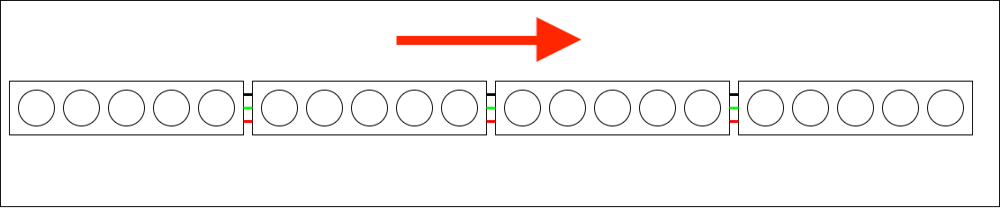
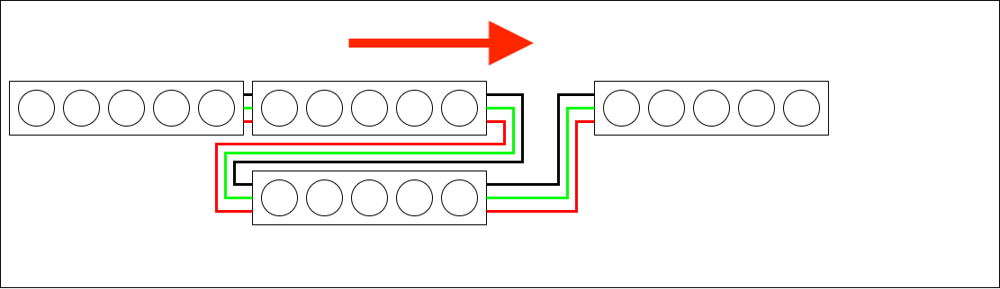
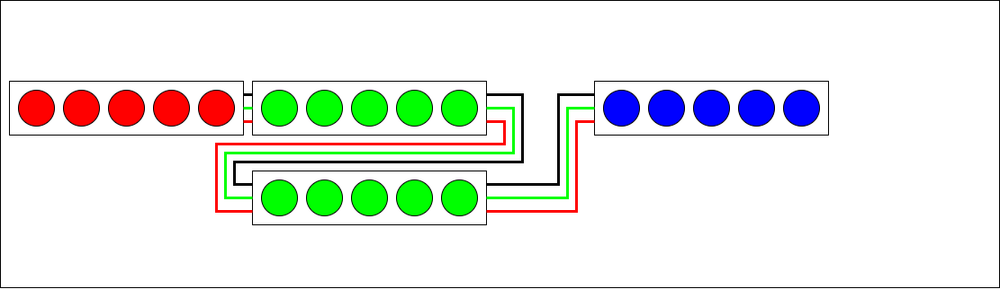
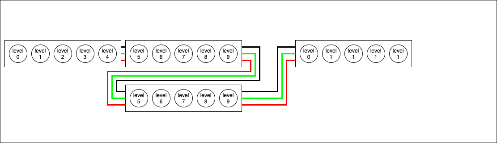
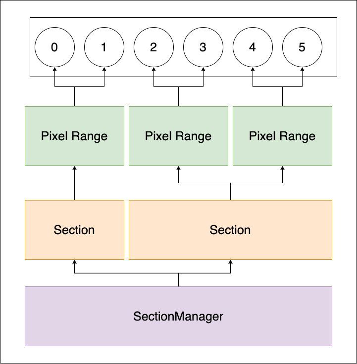

# Strip Section Manager

## Overview

The Strip Section Manager is a set of tools used to augment "sections" of an LED strip so that rows of a given "section" are treated like a single row of a normal LED strip.

_See the [main.cpp](./src/main.cpp) file for detailed examples_


&nbsp;


## E.g.

<!-- TODO: replace with picture of actual wiring -->

If a normal led strip had 20 leds in it and you considered 5 leds a section:



The Section Manager could allow you to do something like make the middle "section" two rows:



And the two rows would be treated as one regular section.

You could then send a single red led animation across the strip like so:

TODO: add demo code once the classes are fully fleshed out

```c++
#define TOTAL_LEDS 20
CRGB leds[TOTAL_LEDS]

SectionManager sectionManager = SectionManager(leds);

sectionManager.addSections(3);

sectionManager.addRangeToSection(0, 0, 4);
sectionManager.addRangeToSection(1, 5, 9);
// Note that because the third led strip (the second range in the second section) is wired
// in reverse according to the left to right direction of our strip we need to tell the
// section manager to handle any iteration over this range in reverse. We can send in an
// optional third boolean value to tell the manager to "reverse" the range.
sectionManager.addRangeToSection(1, 10, 14, true);
sectionManager.addRangeToSection(2, 15, 19);

sectionManager.fillSectionWithColor(0,0xFF0000, FillStyle(ALL_AT_ONCE));
//  Note that when we fill section 1, it fills all of the ranges at the same time
sectionManager.fillSectionWithColor(1,0x00FF00, FillStyle(ALL_AT_ONCE));
sectionManager.fillSectionWithColor(2,0x0000FF, FillStyle(ALL_AT_ONCE));
```

The leds in the middle section would light up, column by column, as if the color was being set for a single pixel.



In addition to setting the color of an entire section at a time you can also iterate over the sections a "level" at a time.

A "level" according to the section manager in our example would be a vertical column of leds:



To itererate over all levels within the section manager as you would a normal single row led strip you could do something like:

```cpp

for(int level = 0; level < sectionManager.getTotalLevels(); level++) {
  sectionManager.setColorAtGlobalIndex(level, 0xFF00FF);
  FastLed.show();
  delay(100);
}
```

The SectionManager is smart enough to send the correct color value to every led in a given level at the same time.

## Class Structure

The classes in this library each group led index ranges in a hierarchy:



- PixelRange is the primary grouping of led indexes and controls which direction the indexes are iterated over
- Sections are groupings of pixel ranges. All Pixel Ranges within a section are treated if they are a single set of leds with each led set controlled as a "level"
  - e.g. if you had 5 ranges in a Section, the led count in the longest range would determine the number of "levels" in the section
  - Note that this concept will change a bit when base offset is introduced, then it will be the longest range + offset determining the number of levels
- SectionManager holds the grouping of all Sections. This is really a convenience class for holding and accessing an array of Sections.
  - You could do the same thing by creating your own array of Sections, the manager just makes iteration a bit cleaner.

## Fill Styles

When filling an entire section at once, there are a couple of FillStyle configurations to pass in that control how the section is filled in.

At the moment there are only two fill styles, but more styles could be added to the struct in future dev.

### All at once

```cpp
  sectionManager.fillSectionWithColor(5, 0x51F0EE, FillStyle(ALL_AT_ONCE));
```

Using the `ALL_AT_ONCE` fill style will fill all of the LEDs in the given section the same color at the same time.

### One at a time

```cpp
  sectionManager.fillSectionWithColor(0, 0x00FFFF, FillStyle(ONE_AT_A_TIME, 100));
```

The `ONE_AT_A_TIME` style will fill each level in a section one at a time in ascending order with a delay between levels according to the number value you pass in as the second parameter.

### One at a time reverse

TODO: add style

### Middle out

TODO: add style

### Outsides to middle

TODO: add style

## Assumptions and restrictions

Note that I'm developing this for a very specific light that has constraints that a more elaborate light wouldn't have. Also note that I'm not thinking of this light as a custom shaped matrix, this is specifically thinking of the strip still as a strip, just one that can get wider than a single line at points.

Because of that and because I'm trying to keep it simple so I can finish the actual project there are some assumptions and restrictions:

- Each row in a section starts at the same point
  - i.e. the starting point of a row can't be offset from another. That's possible, but it's outside of the scope of my current needs
- Each row in a given section has the exact same number of LEDs
  - Again, this is per the scope of my current project, the manager could be augmented to account for this as well, but keeping things simple and in scope

## Future considerations

- If throwing exceptions in arduino land jacks stuff up:
  - How do we handle "ok" out of bounds access? (right now we pass back a -1 index, but is that the best way of handling it?!)
  - How do we message back to the dev when an exceptional situation happens?
    - For this we could write a logger class that uses `Serial` to report back and inject that as a dependency so that the classes don't need to be tied to arduino just for logging
- Ultimately, there's nothing functionality wise that ties this library to FastLED. The classes are really just a way of managing acess to consecutive IDs. I'm using FastLED for for a couple of projects so I just baked it in. That said, I think this library could be made to be more flexible by making Section an abstract class that enforces the core methods and subclassing a FastLEDSection implementation. That way you could create other versions like a NeoPixelSection version to work with adafruit's NeoPixel library.

## To Dos

- Add in index offsetting per range

## POCs

While building this library out I broke out a couple of proof of concept builds to focus on certian concepts:

- [Thinking through the concepts of Range and Section](https://onlinegdb.com/Q00n_FAbj4)
- [Feeling out the concepts of Range, Section, and SectionManager together](https://onlinegdb.com/rtuAZQSD5)
- [Figuring out how to loop over all section "levels" as if they're one combined LED strip](https://onlinegdb.com/kLJ8-M4by)
